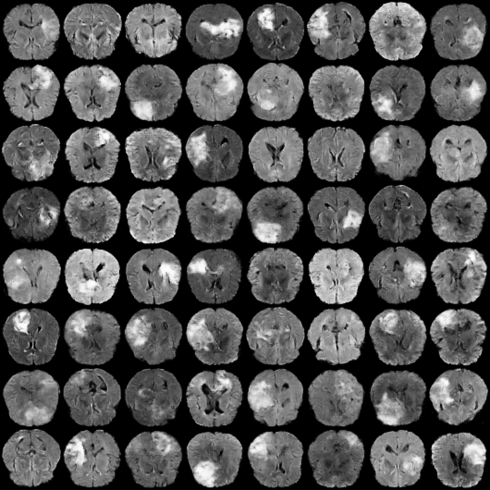

# Synthetic Brain MRI Images Generation with Customised GANs

This project builds and trains a **DCGAN** and a **WGAN-GP** to generate **synthetic 2D brain MRI slices** from **BraTS 2023** dataset, with the flexibility of choosing multiple image resolutions and MRI modalities.

Supported resolutions: **64×64**, **128×128**, **256×256**.

Supported MRI modalities: T1-weighted (t1n), post-contrast T1-weighted (t1c), T2-weighted (t2w), T2 Fluid Attenuated Inversion Recovery (t2f).

<p align="center">  </p>

<p align="center">
  <em>
    An example of the model’s inference output (WGAN-GP, 64×64).
  </em>
</p>

Workflow:

1) Preprocess BraTS volumes → packed `.npy` slices  
2) Train **DCGAN** and/or **WGAN-GP** (optionally with **EMA**)  
3) Evaluate with **FID + KID** (TorchMetrics Inception-v3 features)  
4) Generate synthetic images + grids  

---

## Device (GPU vs CPU)

- All scripts automatically use **GPU (CUDA)** if available; otherwise they run on **CPU**.
- You can confirm the device from the console output (`Device: cuda` or `Device: cpu`).
- CPU is supported but will be **much slower**, especially for training and evaluation.

---

## 0) Environment setup (Windows + Conda)

### 0.1 Create environment (Python 3.10.11)

```bat
conda create -n dcgan_wgan python=3.10.11 -y
conda activate dcgan_wgan
```

### 0.2 Install dependencies

You have two options:

#### Option A (recommended for local dev): install everything
```bat
pip install -r requirements_all.txt
```

#### Option B (per-step installs / per Docker image): install only what you need
Each step folder has its own `requirements.txt`.

Example:
```bat
pip install -r train_wgangp\requirements.txt
```

> If you use CUDA PyTorch wheels, ensure the requirements file includes the correct PyTorch index (e.g. `--extra-index-url https://download.pytorch.org/whl/cu118`).

---

## 1) Repository structure

```
repo_root/
├─ data/                       # NOT committed
│  ├─ raw/                     # put BraTS2023 here
│  └─ preprocessed_slices_64/  # produced by preprocessing (or _128/_256)
├─ runs/                       # NOT committed (checkpoints, samples, logs)
│
├─ preprocess/
│  ├─ preprocess.py
│  └─ requirements.txt
│
├─ train_dcgan/
│  ├─ train_dcgan.py
│  ├─ dataset.py
│  ├─ models_dcgan.py
│  ├─ utils_training.py
│  ├─ config.py
│  └─ requirements.txt
│
├─ train_wgangp/
│  ├─ train_wgangp.py
│  ├─ dataset.py
│  ├─ models_dcgan.py
│  ├─ models_wgangp.py
│  ├─ utils_training.py
│  ├─ config.py
│  └─ requirements.txt
│
├─ generate/
│  ├─ generate.py
│  ├─ models_dcgan.py
│  ├─ utils_training.py
│  ├─ config.py
│  └─ requirements.txt
│
├─ evaluate/
│  ├─ eval_fid_kid.py
│  ├─ dataset.py
│  ├─ models_dcgan.py
│  ├─ config.py
│  └─ requirements.txt
│
└─ requirements_all.txt
```

---

## 2) Download BraTS 2023 data and place it in `data/raw/`

This repository **does not include BraTS data** (and you should not commit it to GitHub).

1. Download BraTS 2023 (licence required).
2. Extract/unzip locally.
3. Put the extracted folders under:

```
data/raw/
```

The preprocessing script searches **recursively**, so nested folders are fine as long as the NIfTI files exist somewhere under `data/raw/`.

Expected modality filename suffixes (BraTS GLI naming):
- `...-t1n.nii.gz`
- `...-t1c.nii.gz`
- `...-t2w.nii.gz`
- `...-t2f.nii.gz`

If preprocessing reports “No files found”, check:
- you used `--raw_dir data/raw`
- your dataset naming matches the expected suffixes

---

## 3) Preprocessing — `preprocess/preprocess.py`

Converts 3D BraTS NIfTI volumes into a packed slice array plus metadata for patient-level splitting.

**Outputs**
- `data/preprocessed_slices_<size>/brats2023_<modality>_<size>_packed.npy`
- `data/preprocessed_slices_<size>/brats2023_<modality>_<size>_packed_metadata.npz`
- metadata stores the patient ID for each packed slice so train/val/test splits happen at the patient level
- slices are float32 in **[-1, 1]**, background ≈ **-1**

### Key parameters

**Core**
- `--raw_dir` *(required)*: root folder containing BraTS, e.g. `data/raw`
- `--out_dir`: output folder, e.g. `data/preprocessed_slices_64`
- `--metadata_out`: optional metadata sidecar path; default is derived from `--packed_out`
- `--modality`: `t1n | t1c | t2w | t2f` (aliases: `t1`, `t1ce`, `t2`, `flair`)
- `--target_size`: `64 | 128 | 256`  
  Suggestion: start with **64** first.

**Slice selection**
- `--min_foreground`: filters nearly-empty slices  
  Suggestion: start at **500**, then tune.
- `--max_slices_per_patient`: cap per patient (0 = no cap)
- `--target_total_slices`: stop after N slices total (0 = no cap)  
  Suggestion: **10000** for fast experiments.
- `--selection`: `topk_foreground | uniform | random`  
  Suggestion: `topk_foreground` for higher-quality slices.
- `--seed`: random seed controlling deterministic slice selection (reproducibility across runs)

**Optional PNG previews**
- `--save_png_samples`: saves a small subset of processed slices as PNGs for visual inspection
- `--png_every_n_patients`: save PNGs from every Nth patient
- `--png_max_per_patient`: maximum PNG slices saved per selected patient

### Example command (64×64, T2f, ~10k slices)

```bat
python preprocess\preprocess.py ^
  --raw_dir data\raw ^
  --out_dir data\preprocessed_slices_64 ^
  --modality t2f ^
  --target_size 64 ^
  --min_foreground 500 ^
  --target_total_slices 10000 ^
  --selection topk_foreground ^
  --seed 42 ^
  --save_png_samples
```

---

## 4) Train DCGAN — `train_dcgan/train_dcgan.py`

### Key parameters

**Data**
- `--data_dir`: directory containing the packed dataset file and matching metadata sidecar
- `--out_dir`: output run folder for checkpoints/samples
- `--image_size`: must match preprocessing size (`64/128/256`)
- `--seed`: random seed for reproducibility (PyTorch/NumPy RNG)

**Model**
- `--z_dim`: latent dim (typical: **128**)
- `--ngf`, `--ndf`: channel multipliers (typical: **64**)  
  Increase for quality, decrease for speed/VRAM.

**Optimisation**
- `--epochs`: number of training epochs
- `--batch_size`: batch size per step; increase if VRAM allows for faster throughput
- `--lrG`: generator learning rate (TTUR; often slightly higher than D)
- `--lrD`: discriminator learning rate
- `--beta1`: Adam beta1 (DCGAN often uses **0.5**)
- `--beta2`: Adam beta2 (DCGAN often uses **0.999**)

**AMP**
- `--use_amp` / `--no_amp`: : enable/disable mixed precision  
  Suggestion: enable AMP on GPU unless you see instability.

**EMA**
- `--ema`: enable EMA tracking for generator weights (cleaner samples + better FID/KID stability)
- `--ema_beta`: EMA smoothing factor (e.g. **0.999** or **0.9995**)
- `--ema_start_epoch`: epoch number to start updating EMA

**Saving / resume**
- `--save_samples_every`: save a sample grid PNG every N epochs
- `--save_ckpt_every`: save a checkpoint every N epochs
- `--resume <checkpoint_path>`: resume training from a saved checkpoint

### Example command (DCGAN 64×64)

```bat
python train_dcgan\train_dcgan.py ^
  --data_dir data\preprocessed_slices_64 ^
  --out_dir runs\dcgan_64 ^
  --image_size 64 ^
  --batch_size 128 ^
  --epochs 100 ^
  --lrG 4e-4 ^
  --lrD 2e-4 ^
  --use_amp ^
  --save_progress_every 1 ^
  --ema ^
  --ema_beta 0.999
```

---

## 5) Train WGAN-GP — `train_wgangp/train_wgangp.py`

### Key parameters

**Data**
- `--data_dir`: directory containing the packed dataset file
- `--out_dir`: output run folder for checkpoints/samples
- `--image_size`: must match preprocessing size (`64/128/256`)
- `--seed`: random seed for reproducibility (PyTorch/NumPy RNG)

**Model**
- `--z_dim`: latent vector dimension (typical: **128**)
- `--ngf`: generator base channel multiplier (typical: **64**)
- `--ndf`: critic base channel multiplier (typical: **64**)

**Optimisation**
- `--epochs`: number of training epochs (common: **100–200**)
- `--batch_size`: batch size (e.g. **64** at 64×64; reduce for larger image sizes)
- `--lr`: learning rate for both generator and critic optimisers (WGAN-GP often uses **1e-4**)
- `--beta1`, `--beta2`: Adam betas (WGAN-GP often uses `beta1=0.0, beta2=0.9`)
- `--n_critic`: number of critic updates per generator update (typical **5**)
- `--lambda_gp`: gradient penalty weight (typical **10**)

**Speed knob**
- `--gp_every`: compute gradient penalty every N critic steps  
  - `1` = every critic step (most accurate, slowest)  
  - `2` or `4` = faster  
  Suggestion: start with **1**, then try **2** if training is too slow.

**EMA**
- `--ema`, `--ema_beta`, `--ema_start_epoch` (same idea as DCGAN)

### Example command (WGAN-GP 64×64, faster GP)

```bat
python train_wgangp\train_wgangp.py ^
  --data_dir data\preprocessed_slices_64 ^
  --out_dir runs\wgangp_64 ^
  --image_size 64 ^
  --batch_size 64 ^
  --epochs 100 ^
  --n_critic 5 ^
  --lambda_gp 10 ^
  --gp_every 2 ^
  --ema ^
  --ema_beta 0.999
```

---

## 6) Evaluate FID/KID — `evaluate/eval_fid.py`

Computes FID + KID using **TorchMetrics Inception-v3 (ImageNet)** features.
The evaluation loader uses the same patient-level split metadata as training, so real test slices come only from held-out patients.

### Key parameters

- `--ckpt` *(required)*: path to the GAN checkpoint (`.pt`) containing `G` (and optionally `G_ema`)
- `--data_dir` *(required)*: directory containing the preprocessed dataset used for real samples
- `--num_real`: number of real images sampled from the dataset to compute metrics  
- `--num_fake`: number of fake images generated from the checkpoint to compute metrics  
  Suggestion: **2000** for quick comparisons; increase to **5k/10k** for more stable estimates.
- `--batch_size`: batch size used for iterating through real samples and generating fake samples
- `--use_ema` / `--no_ema`: choose whether to evaluate using EMA generator weights (`G_ema`) if available, or force raw weights (`G`)  
  Suggestion: report both raw and EMA, or use EMA as primary if you trained with EMA.
- `--kid_subset_size`: subset size used internally by TorchMetrics KID; must be ≤ both `num_real` and `num_fake`  
  Suggestion: **1000** for speed; increase if you increase `num_real/num_fake`.

### Example command (EMA, 2k/2k)

```bat
python evaluate\eval_fid.py ^
  --data_dir data\preprocessed_slices_64 ^
  --ckpt runs\wgangp_64\checkpoint_latest.pt ^
  --num_real 2000 ^
  --num_fake 2000 ^
  --batch_size 32 ^
  --use_ema ^
  --kid_subset_size 1000
```

---

## 7) Generate images — `generate/generate.py`

Generates synthetic images from a checkpoint and optionally saves:
- a grid PNG
- individual PNGs
- a packed `.npy`

### Key parameters

- `--ckpt` *(required)*: path to the trained checkpoint (`.pt`) to load the generator from
- `--out_dir`: output directory to save generated files (PNGs and/or `.npy`)
- `--num`: total number of images to generate
- `--batch_size`: generation batch size (increase for speed if GPU memory allows)
- `--seed`: random seed for reproducible sampling (same seed → same generated images)
- `--use_ema` / `--no_ema`: use EMA generator weights (`G_ema`) if present, or force raw generator (`G`)
- `--save_grid`: save a single grid image composed of multiple generated samples
- `--grid_nrow`: number of columns in the grid (e.g. 8 → 8×8 when generating 64 images)
- `--grid_px`: pixel size of the saved grid image (saved as `grid_px × grid_px`, e.g. **1600×1600**)
- `--save_individual`: save each generated sample as an individual PNG file
- `--save_npy`: save all generated samples into one packed `.npy` array (shape `(N, H, W)` in `[-1, 1]`)
- `--tag`: optional label appended to output filenames (useful to distinguish model/resolution/runs)

### Example command (1600×1600 grid)

```bat
python generate\generate.py ^
  --ckpt runs\wgangp_64\checkpoint_latest.pt ^
  --out_dir runs\generated\wgangp_64 ^
  --num 64 ^
  --batch_size 64 ^
  --save_grid ^
  --grid_nrow 8 ^
  --grid_px 1600 ^
  --use_ema ^
  --tag wgangp64
```

---

